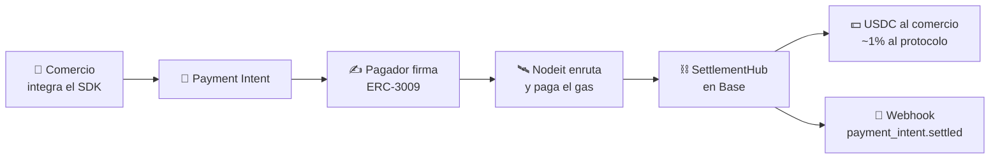

<div align="center">

[](https://laca-soft.com)

[](https://laca-soft.com/)
[](https://coatipay.com/)
[](https://github.com/lacasoft)
[](https://github.com/lacasoft?tab=followers)


**`Shipping desde 2014`** · **`Productos en producción`** · **`Open source en USDC/Base`**

</div>


##  whoami

```typescript
const laca = {
  role:     "Digital Product Architect · 0→1 Builder",
  base:     "México 🇲🇽 · remoto",
  shipping: "desde 2014",
  building: ["CoatiPay — pagos USDC sin custodia", "Evva — asistente IA con memoria real"],
  live:     ["primelane.vip", "miguardia.app", "velada.mx", "yolopicho.com"],
  stack:    ["TypeScript", "NestJS", "Angular", "Solidity", "Python", "Flutter"],
  edge:     "entiendo el negocio antes de escribir la primera línea de código",
};
```

Tomo una idea en servilleta y la convierto en un producto digital rentable con arquitectura enterprise desde el día uno. Últimamente eso incluye **protocolo propio, contratos on-chain y SDKs publicados**, no solo aplicaciones.

```
💡 Idea → 🔍 Mercado → 📐 Product Design → 🏗️ Arquitectura → 🚀 MVP → 📈 Escala → 🌐 Open Source
```

> *No solo escribo código. Diseño sistemas de negocio completos que resuelven problemas reales y generan valor.*


##  Now Building — CoatiPay

<div align="center">

### **Pagos en USDC sin custodia y sin gas para quien paga**

[](https://github.com/lacasoft/coatipay-protocol)
[](https://www.npmjs.com/package/@lacasoft/coatipay-sdk)


</div>

Una **red abierta de enrutamiento de pagos**: la DX de Stripe (`paymentIntents.create`, webhooks firmados, dashboard) sobre USDC en Base, con liquidación on-chain y **cero intermediario que custodie el dinero**.



<table>
<tr>
<td width="50%">

**Lo que resuelve**
- ⛽ **Gasless para el pagador** — firma una autorización ERC-3009; el nodeit pone el gas
- 🤖 **x402** — micropagos por request para agentes de IA, en montos que Stripe no puede servir
- 🧩 **DX tipo Stripe** — SDKs en JS/TS, Python y PHP
- 🌐 **Sin lock-in** — self-host o cualquier nodeit de la red

</td>
<td width="50%">

**Lo que NO es**
- ❌ Un banco — los fondos van del pagador al comercio, nunca hay custodia
- ❌ Una pasarela fiat — convive con lo que ya usas
- ❌ Un proyecto de token — no existe token; los nodeits ganan USDC
- ⚠️ **Estado:** testnet (Base Sepolia), contratos verificados, **auditoría pendiente**

</td>
</tr>
</table>

<details>
<summary><b>👀 Ver el SDK en acción</b></summary>
<br>

```typescript
import { CoatiPay } from '@lacasoft/coatipay-sdk'

const relay = new CoatiPay({ apiKey: process.env.COATIPAY_SECRET_KEY! })

// Cobrar 10 USDC — mismas primitivas que ya conoces
const intent = await relay.paymentIntents.create({
  amount: 10_000_000,          // 6 decimales → 1 USDC = 1_000_000
  currency: 'usdc',
  chain: 'base',
  metadata: { orderId: 'order_123' },
})

// Cobrar por request a un agente de IA (x402)
app.addHook('preHandler', relay.x402.middleware({ price: 300_000 }))
```

</details>

<div align="center">

[](https://github.com/lacasoft/coatipay-protocol)
[](https://github.com/lacasoft/coatipay-js-sdk)
[](https://github.com/lacasoft/coatipay-python-sdk)
[](https://github.com/lacasoft/coatipay-php-sdk)

</div>


##  Open Source

### ⭐ Destacados

<table width="100%">
<tr>
<td width="50%" valign="top">

#### ⛓️ [coatipay-protocol](https://github.com/lacasoft/coatipay-protocol)

Contratos y protocolo de pagos USDC: settlement, registro de nodeits, staking y disputas. Desplegado y **verificado en Basescan**.

<a href="https://github.com/lacasoft/coatipay-protocol"></a>   

</td>
<td width="50%" valign="top">

#### 🧩 [coatipay-js-sdk](https://github.com/lacasoft/coatipay-js-sdk)

SDK JS/TS con DX de Stripe sobre USDC en Base. Gasless (ERC-3009), webhooks firmados y x402. **Publicado en npm**.

<a href="https://github.com/lacasoft/coatipay-js-sdk"></a>   

</td>
</tr>
<tr>
<td width="50%" valign="top">

#### 🤖 [evva-ai](https://github.com/lacasoft/evva-ai)

Asistente personal con memoria semántica real y acciones proactivas. 28 skills, 60 tools, Telegram + WhatsApp.

<a href="https://github.com/lacasoft/evva-ai"></a>   

</td>
<td width="50%" valign="top">

#### 🛠️ [dev-starter-kit](https://github.com/lacasoft/dev-starter-kit)

Base coherente de Claude Code para todo el equipo: 14 agentes, 15 skills y 13 stacks, con enjambre híbrido.

<a href="https://github.com/lacasoft/dev-starter-kit"></a>   

</td>
</tr>
<tr>
<td width="50%" valign="top">

#### 🔑 [git-account-manager](https://github.com/lacasoft/git-account-manager)

Multi-cuenta de GitHub por SSH en un solo comando. Bash puro, cero dependencias, Linux y macOS.

<a href="https://github.com/lacasoft/git-account-manager"></a>   

</td>
<td width="50%" valign="top">

#### 🅰️ [angular-dashboard-template](https://github.com/lacasoft/angular-dashboard-template)

Starter Angular enterprise: standalone components, Signals y design system con dark/light.

<a href="https://github.com/lacasoft/angular-dashboard-template"></a>  

</td>
</tr>
</table>

### 📚 Catálogo público


| Repo | Qué es | Stack | Actividad |
|:--|:--|:--|:--|
| **[coatipay-protocol](https://github.com/lacasoft/coatipay-protocol)** | Contratos y protocolo: settlement, registro de nodeits, staking y disputas | `Solidity` `Apache-2.0` |  |
| **[coatipay-js-sdk](https://github.com/lacasoft/coatipay-js-sdk)** | SDK JS/TS compatible con Stripe · publicado en npm | `TypeScript` `viem` |  |
| **[coatipay-python-sdk](https://github.com/lacasoft/coatipay-python-sdk)** | SDK async para Python 3.11+ | `Python` `httpx` `pydantic` |  |
| **[coatipay-php-sdk](https://github.com/lacasoft/coatipay-php-sdk)** | SDK para PHP 8.1+ | `PHP` `Guzzle` |  |
| **[dev-starter-kit](https://github.com/lacasoft/dev-starter-kit)** | Config `.claude` unificada: 14 agentes, 15 skills y 13 stacks (backend/frontend/mobile/blockchain) con enjambre híbrido | `Node` `Claude Code` `MIT` |  |
| **[evva-ai](https://github.com/lacasoft/evva-ai)** | Asistente personal IA con memoria semántica real y acciones proactivas · 28 skills, 60 tools, Telegram + WhatsApp | `NestJS` `pgvector` `Claude` |  |
| **[git-account-manager](https://github.com/lacasoft/git-account-manager)** | Multi-cuenta de GitHub por SSH en un comando · bash puro, cero dependencias | `Shell` `zero-deps` |  |
| **[angular-dashboard-template](https://github.com/lacasoft/angular-dashboard-template)** | Starter enterprise: standalone components, Signals y design system con dark/light | `Angular` `SCSS` |  |
| **[ls-nestjs-template-cli](https://github.com/lacasoft/ls-nestjs-template-cli)** | CLI para generar proyectos NestJS con templates propios | `TypeScript` `CLI` |  |
| **[NestJS_Bootstrap](https://github.com/lacasoft/NestJS_Bootstrap)** | Template empresarial NestJS: arquitectura modular, seguridad y buenas prácticas | `NestJS` |  |
| **[WhatsApp-Bot](https://github.com/lacasoft/WhatsApp-Bot)** · **[n8n_ig_post](https://github.com/lacasoft/n8n_ig_post)** · **[n8n_chatbot_web](https://github.com/lacasoft/n8n_chatbot_web)** | Automatización: bots de WhatsApp y workflows de n8n para contenido y atención | `TypeScript` `n8n` |  |

<div align="center"><sub>⭐ Si algo de aquí te sirve, una estrella ayuda a que llegue a más gente.</sub></div>


##  Products in Production (0→1)

<details open>
<summary><b>🎟️ PrimeLane — Event Ticketing & Access Control SaaS</b></summary>
<br>

  

**Problema identificado:** Organizadores de eventos dependientes de plataformas con comisiones abusivas y sin control sobre su marca.

**Solución diseñada:** Plataforma multi-tenant con portales white-label por organizador, venta de boletos con Stripe, validación QR en tiempo real (SSE), 5 roles de usuario y dashboard analytics completo.

**Impacto:** Democratización de la venta de boletos — desde eventos independientes hasta grandes festivales, cualquier organizador gestiona y vende de forma autónoma.

**Stack:** Angular 20 • TailwindCSS • TypeScript • Stripe • QR/zxing • SSE • PWA • i18n

🔗 [primelane.vip](https://www.primelane.vip/)

</details>

<details open>
<summary><b>🏢 MiGuardia — Enterprise Access Control Platform</b></summary>
<br>

  

**Problema identificado:** Control de acceso residencial ineficiente, basado en papel, sin trazabilidad.

**Solución diseñada:** PWA empresarial con validación QR, sincronización offline-first, alertas en tiempo real y bitácora completa de incidentes.

**Impacto:** Producto SaaS en producción sirviendo múltiples complejos residenciales.

**Stack:** Angular 19 • PWA • REST APIs • OAuth 2.0 • Real-time sync • Offline-capable

🔗 [miguardia.app](https://www.miguardia.app/)

</details>

<details open>
<summary><b>🤖 Evva — AI Personal Assistant (open source)</b></summary>
<br>

  

**Problema identificado:** Los asistentes de IA olvidan todo entre conversaciones y solo reaccionan; nunca se adelantan.

**Solución diseñada:** Agente con **memoria semántica persistente** (PostgreSQL + pgvector), briefing proactivo diario, recordatorios programados, visión, transcripción de voz y skills que se extienden en runtime. Vive en Telegram y WhatsApp.

**Escala funcional:** 28 skills · 60 tools · 2 canales · integraciones con Calendar, Gmail, Spotify, búsqueda web y finanzas personales.

**Stack:** NestJS • TypeScript • Claude (Vercel AI SDK) • Voyage embeddings • pgvector • BullMQ + Redis • grammY • pnpm workspaces

🔗 [github.com/lacasoft/evva-ai](https://github.com/lacasoft/evva-ai) · [probar el bot](https://t.me/evva_dev_bot)

</details>

<details open>
<summary><b>🧦 VELADA — Premium DTC Brand + E-commerce</b></summary>
<br>

  

**Oportunidad detectada:** Mercado de calcetines commoditizado, sin propuesta de valor diferenciada.

**Solución diseñada:** Marca premium posicionada en "sleep technology" con producto de bambú y e-commerce optimizado para conversión.

**Impacto:** Brand positioning único en mercado mexicano, e-commerce completo con gestión de inventario.

**Stack:** React • TypeScript API • E-commerce • Gestión de inventario

🔗 [velada.mx](https://velada.mx/)

</details>

<details open>
<summary><b>🍽️ YoLoPicho — Social Impact Platform</b></summary>
<br>

  

**Problema identificado:** Desconexión entre la voluntad de ayudar de las personas y quienes más lo necesitan.

**Solución diseñada:** Plataforma que conecta restaurantes con clientes, transformando micro-donativos en comidas reales para personas vulnerables, con trazabilidad completa y transparencia total.

**Impacto:** Ecosistema funcional de restaurantes, donantes y beneficiarios con seguimiento fotográfico de cada donación.

**Stack:** Flutter • Dart • Sistema de reportes • Notificaciones • Trazabilidad end-to-end

🔗 [yolopicho.com](https://yolopicho.com/)

</details>

<details>
<summary><b>📝 LACA-SOFT — Tech & Innovation Knowledge Hub</b></summary>
<br>

  

**Visión:** Un espacio donde tecnología, innovación e ideas disruptivas convergen.

**Contenido:** Blog especializado en startups, seguridad, desarrollo de software, AI/LLMs, y estrategia tecnológica para founders y equipos técnicos.

🔗 [laca-soft.com](https://laca-soft.com/)

</details>


##  Enterprise Tech Stack

<div align="center">

### Languages
<p></p>

### Backend & APIs
<p></p>


### Frontend & Mobile
<p></p>


### AI & Agents


### Web3 & Payments


### Data & Infra
<p></p>


</div>


##  GitHub Activity

<div align="center">


</div>


## 🔥 What Sets Me Apart

<div align="center">

| | Fortaleza | En la práctica |
|:---:|:---|:---|
| 🧭 | **BUSINESS + TECH** | Entiendo el "por qué" antes del "cómo": unit economics, monetización y arquitectura en la misma conversación |
| 🏗️ | **0→1 BUILDER** | Diseño productos completos, no features sueltas — de la hipótesis al producto en producción |
| ⛓️ | **PROTOCOL-LEVEL** | Bajo hasta contratos, staking y liquidación on-chain cuando el producto lo exige |
| 🤖 | **AI-NATIVE** | Agentes con memoria, RAG y tooling propio; no wrappers de chat |
| 🧬 | **ENTERPRISE DNA** | Multi-tenant, offline-first, OAuth 2.0, testing y CI desde el día uno |
| ✅ | **TRACK RECORD** | 5 productos en producción, SDKs publicados y +25 repos públicos desde 2014 |

</div>


##  Let's Build Something Remarkable

<div align="center">

¿Tienes una idea que necesita convertirse en producto?
¿Buscas a alguien que entienda tanto el negocio como la tecnología?

### **Hablemos.** 🤝

[](https://laca-soft.com/)
[](mailto:laca@laca-soft.com)
[](https://coatipay.com/)

<br>

<sub>**LACA-SOFT** • Enterprise-Grade Digital Products • México 🇲🇽</sub>

</div>


